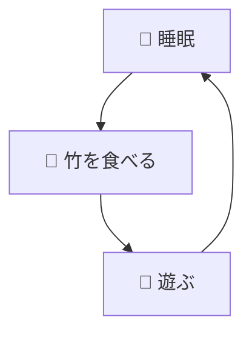

# パンダ

パンダは中国固有の**国宝級**の動物で、竹が大好きです。

## 3つの豆知識
- 1日の半分は寝ている
- 1日に12〜38kgの竹を食べる
- 実は木登りの達人

## もっと詳しく
さらに知りたい？ [Wikipediaのパンダの記事](https://ja.wikipedia.org/wiki/パンダ) を見てみましょう！

## パンダの一日

```mermaid
flowchart TD
    A[🌙 睡眠] --> B[🎋 竹を食べる]
    B --> C[🧸 遊ぶ]
    C --> A
```
